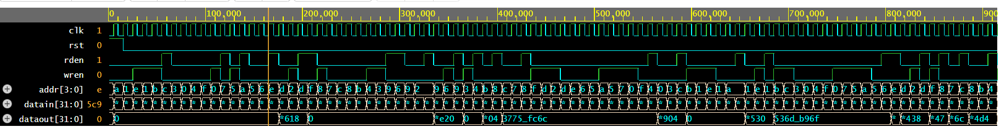

# UVM_memory_model
Simple UVM TB Memory Model

# UVM Testbench for Simple Memory

This repository contains a **UVM-based testbench** for verifying a simple synchronous memory.  
The environment demonstrates core UVM concepts such as sequences, driver, monitor, agent, scoreboard, and virtual interfaces.

---

## 📁 Repository Structure

```text
.
├── README.md
├── simple_mem.sv
├── testbench.sv
├── output_log.txt
└── images
    └── waveform.png
```


---

## 🧠 Design Description

The DUT is a **simple memory** with the following interface:

| Signal   | Direction | Description              |
|---------|-----------|--------------------------|
| clk     | Input     | Clock                    |
| rst     | Input     | Active-high reset        |
| wren    | Input     | Write enable             |
| rden    | Input     | Read enable              |
| addr    | Input     | Address (4-bit)          |
| datain  | Input     | Write data (32-bit)      |
| dataout | Output    | Read data (32-bit)       |

---

## 🧪 UVM Testbench Architecture

The testbench follows a **standard active-agent UVM architecture**:

- **Sequence (`myseq`)**  
  Generates randomized read/write transactions.

- **Driver**  
  Drives transactions to the DUT using a virtual interface, synchronized to the clock.

- **Monitor**  
  Samples DUT signals and publishes transactions via an analysis port.

- **Scoreboard**  
  Maintains a reference memory model and checks read data correctness.

- **Agent / Environment / Test**  
  Connects all components and controls simulation flow.

---

## 📊 Simulation Waveform

Below is a waveform snippet captured during simulation, showing clocked read/write transactions:



### Signals shown:
- `clk`
- `rst`
- `wren`, `rden`
- `addr`
- `datain`
- `dataout`

---

## ▶️ How to Run (EDA Playground)

1. Go to **https://edaplayground.com**
2. Select:
   - **Language:** SystemVerilog
   - **Libraries:** UVM → UVM 1.2
3. Place:
   - `simple_mem.sv` → **Design panel**
   - `testbench.sv` → **Testbench panel**
4. Enable:
   - ✅ Use UVM
5. Run the simulation

Waveforms are dumped using `$dumpfile` / `$dumpvars`.

---


